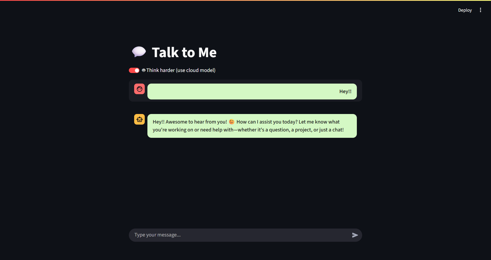

# 🧠 MemorySession-LLM

A conversational Streamlit chatbot app powered by local (Ollama) and cloud (OpenRouter) LLMs with session memory and a toggleable "Think Harder" mode.

---

## 🚀 Features

- 💬 Chat interface with real-time streaming responses
- 🧠 Session memory for context-aware conversation
- 🔁 Toggle between small (local) and large (cloud) models
- 🎨 Custom-styled dark mode UI with improved readability
- 🌐 Supports OpenRouter (e.g. DeepSeek) and Ollama (e.g. Gemma)

---

## 🛠 Tech Stack

- [LangChain](https://github.com/langchain-ai/langchain)
- [LangChain Community](https://github.com/langchain-ai/langchain-community)
- [Streamlit](https://streamlit.io/)
- [Ollama](https://ollama.ai/) (Local model runner)
- [OpenRouter](https://openrouter.ai/) (API gateway for open models)
- [Python dotenv](https://pypi.org/project/python-dotenv/)

---

## 📁 Project Structure

```
MemorySession-LLM/
│
├── app.py                # Main Streamlit 
├── .env                  # Environment variables (model names, API keys)
├── requirements.txt      # Python dependencies
└── README.md             # Project overview
```

---

## ⚙️ Setup Instructions

### 1. Clone the repo
```bash
git clone https://github.com/your-username/MemorySession-LLM.git
cd MemorySession-LLM
```

### 2. Install dependencies
```bash
pip install -r requirements.txt
```

### 3. Setup `.env`
Create a `.env` file with the following:
```env
LOCAL_BASE_URL=http://localhost:11434/v1
REMOTE_BASE_URL=https://openrouter.ai/api/v1
LOCAL_MODEL_NAME=<model_name>
REMOTE_MODEL_NAME=<model_name>
OPENROUTER_API_KEY=your-openrouter-api-key
```

### 4. Run Ollama locally
Install and start Ollama:
```bash
ollama run <model_name>
```

### 5. Launch the app
```bash
streamlit run app.py
```

---

## 📸 UI Preview

 <!-- Replace with your image path -->

---

## 🧪 Example Prompts

- "Summarize the Industrial Revolution."
- "What is the capital of Japan?"
- "Write a Python function to sort a list of dictionaries."

---

## 📌 Notes

- You can toggle between small (Ollama) and large (OpenRouter) models using the **“Think harder...”** checkbox.
- Ensure Ollama is running before using local models.

---

## 📄 License

MIT License © 2025 Saravanan PV
